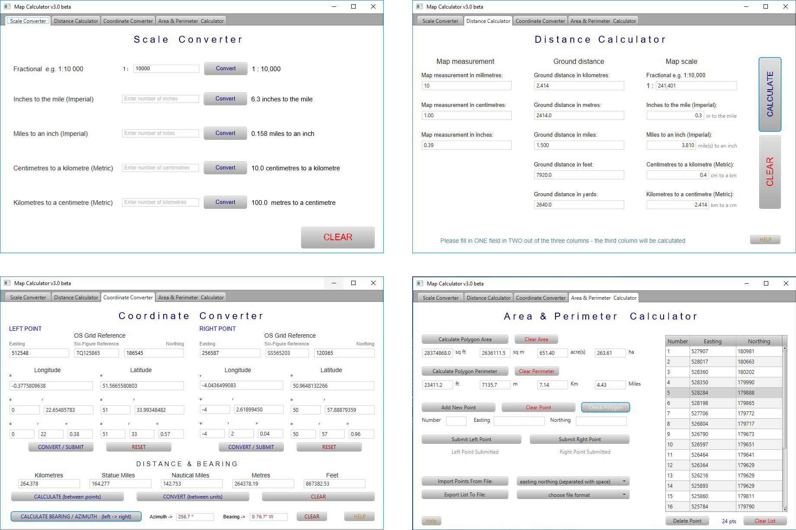
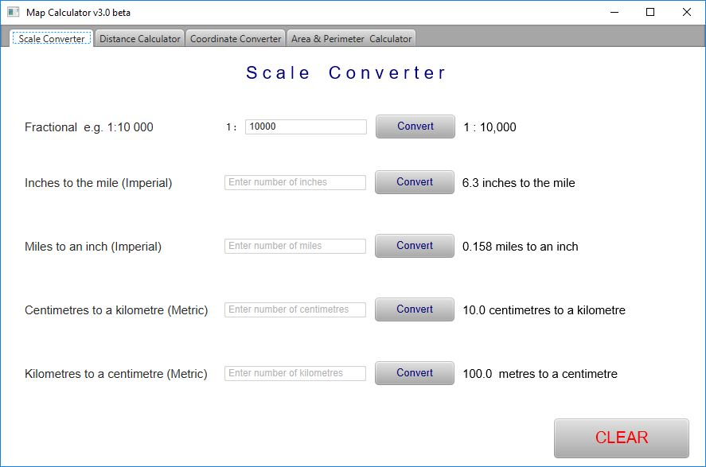
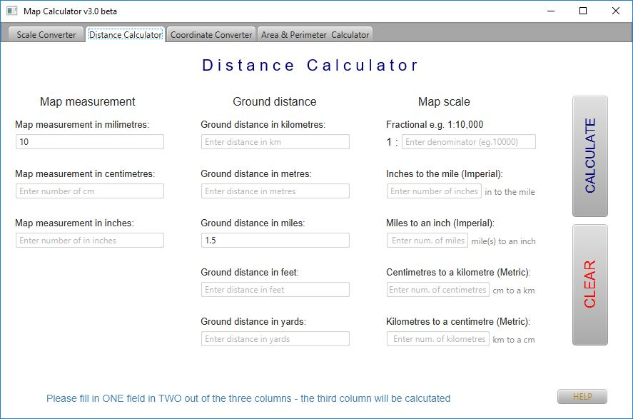
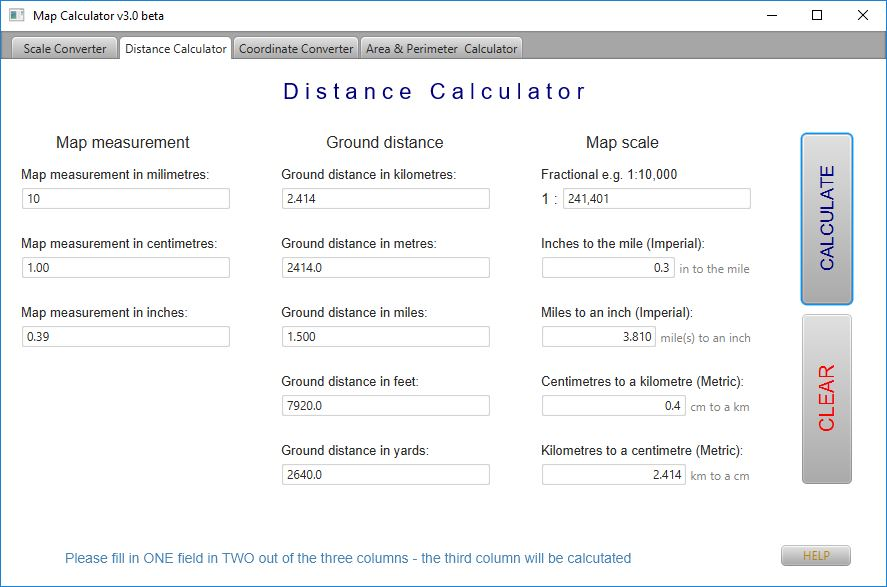
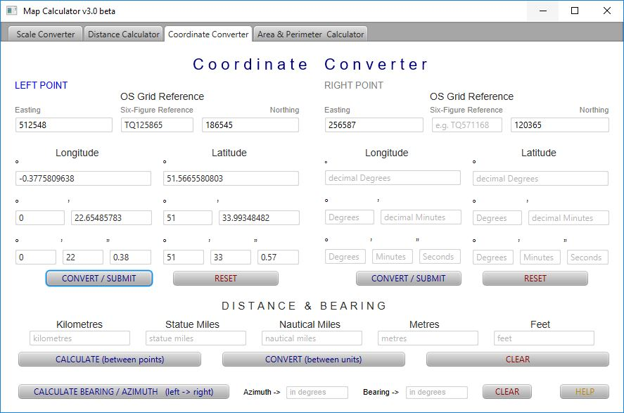
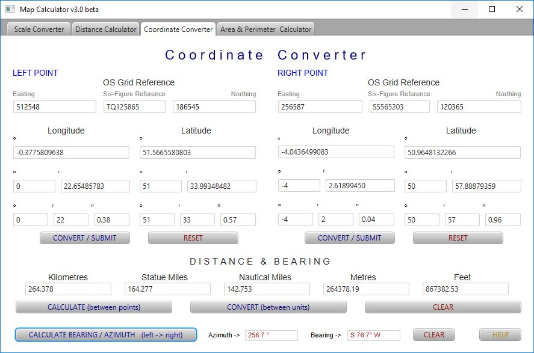
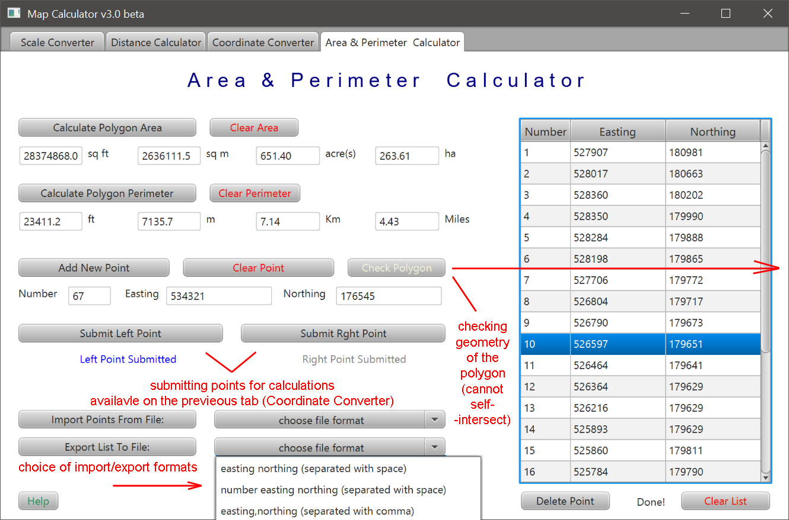
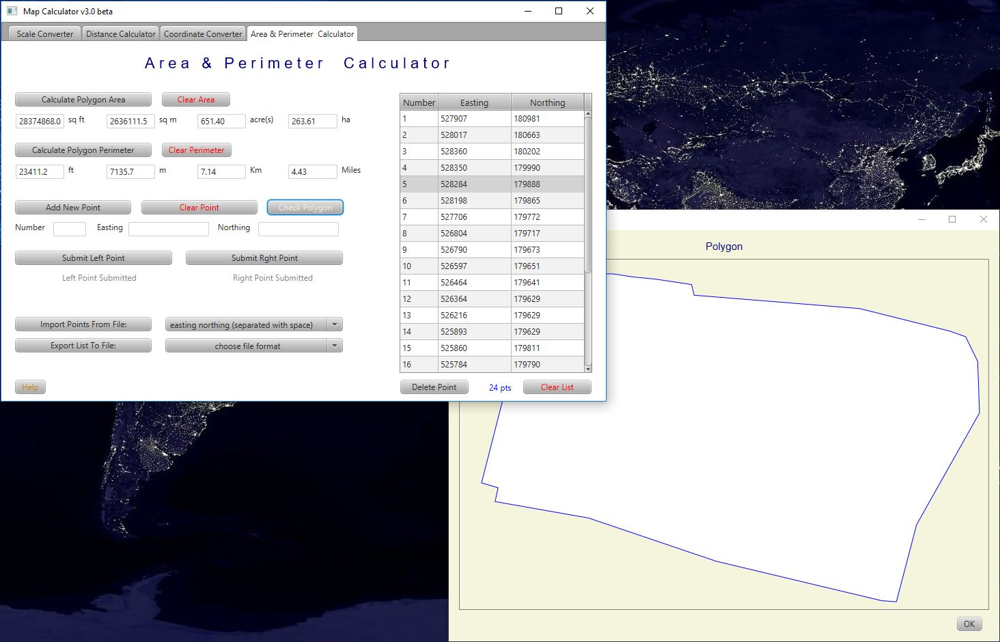

# SubsConverterFX

A few utilities one might find quite handy when dealing with maps. 

## Table of contents
* [General Info](#general-info)
* [Technologies](#technologies)
* [Setup](#setup)
* [Launch](#launch)
* [Features](#features)
* [Status](#status)
* [License](#license)
* [Contact](#contact)

# General Info

A set of map tools consisting of:
 - scale converter
 - distance / scale calculator
 - coordinate converter (Ordnance Survey grid reference to/from Latitude and Longitude)
 - polygon area and perimeter calculator
 
 **Screenshots**

	

# Technologies
- Java JDK 1.8
- JavaFX 8
- Scene Builder
- started on Eclipse, then switched to IntelliJ IDEA. 
- Maven version 3.60

**Plugins and libraries**
- Maven Compiler plugin 3.8.0
- Maven Site plugin version 3.6
- Maven Antrun plugin version 1.8
- Maven Shade plugin version 2.4.1
- Maven Assembly plugin  version 2.4
- Maven Surefire plugin  version 2.22.0
- JUnit5  version 5.4.1
- Launch4j version 1.7.25
- JCoord version 1.0 (by Jonathan Stott)

# Setup

Clone the repository to a folder on your computer and import it in your favourite IDE.

### Build

Run - *mvn clean package* - it creates an executable .jar (with all the dependencies included) as well as a Windows
 .exe wrapper of the same .jar. Also, necessary folder/file structure is copied next to the executable files (*images* 
 folder and its content). All of it is then packed in a ZIP file format for portability as a release version.

# Launch

Download the **MapCalculatorFX-X.X.X.X-release.zip** file where **X.X.X.X** is a release version. Unpack it and double 
click
the .exe file.

# Features

There are 4 tabs, each serving different set of calculation/conversion.

**Tab1 - Scale Converter**

Converting map scales between each other expressed in 5 different map scale formats.
A value entered in one of the formats gets converted into the remaining four.

 - Fractional (eg. 1:10,000)
 - Imperial/inches to the mile (eg. 6 in to the mile)
 - Imperial/miles to an inch (eg. 4 miles to an inch)
 - Metric/centimetres to a kilometre (eg. 4cm to a km
 - Metric/kilometres to a centimetre (eg. 2km to a cm)
 

	

**Tab2 - Distance Calculator**

There are three sets of entry fields:

 - map measurement - length between points measured on the map (in mm, cm or inches)
 - ground distance - distance between those points on the ground (in metres, km, miles, yards or feet)
 - map scale - the scale of the map (fractional, imperial or metric)

You need to enter values into two out of the three fields (map + ground distance, map distance + scale or ground distance + scale) 
and the remaining field is calculated along with the missing values for all the units.

 

**Tab3 - Coordinate Converter**

Part of calculations on this screen make use of the excellent JCoord library

 - there are two points, each with a set of coordinates
 - Ordnance Survey Grid Reference - six-figure grid reference or six digit Easting and six digit Northing (location precision to 1 metre)
 - Latitude and Longitude - decimal degrees, degrees and decimal minutes or degrees, minutes and decimal seconds
 - coordinates entered in one way are converted to the other (this can be used as a feature on its own)
 - if coordinates for both points are entered distance calculation between those points can be done, the distance 
 calculated is presented in kilometres, metres, feet, statue miles and nautical miles (this can also be used as a standalone converter between aforementioned distance units)
  - having coordinates for two points the azimuth and bearing (in degrees) can be calculated

At any stage coordinates of either point can be reset and corrected manually.

 

**Tab4 - Area & Perimeter Calculator**

Given coordinates of at least three points calculates area and perimeter of a closed shape

 - coordinates must be in OS Grid reference format, six digit Easting and six digit Northing
 - points can be added manually one by one (with point number assigned manually or automatically)
 - points also can be loaded from a text file that follows four types of formatting:
    - Easting Northing (separated with space)
    - Easting Northing (separated with a comma)
    - Number Easting Northing (separated with space)
    - Number Easting Northing (separated with comma)
 - once the points are entered (or loaded) a polygon check can be done (the polygon cannot be self intersecting)
 - points can be deleted or edited directly in the table
 - the area is calculated in Imperial and Metric units (hectares, acres, square metres and square feet)
 - the perimeter also is calculated in Imperial and Metric units (kilometres, miles, metres and feet)
 - points from the table can be submitted as left/right points for calculations in the Tab3 (Coordinate Converter)

	

	

# Status
Development: Closed
Bug fixing: Open

# License
MapCalculatorFX is free software: you can redistribute it and/or modify it under the terms of the GNU General Public 
License as published by the Free Software Foundation, either version 3 of the License, or (at your option) any later version.
MapCalculatorFX is distributed in the hope that it will be useful, but WITHOUT ANY WARRANTY; without even the implied warranty of  MERCHANTABILITY or FITNESS FOR A PARTICULAR PURPOSE.  See the GNU General Public License for more details.
You should have received a copy of the GNU General Public License along with MapCalculatorFX.  If not, see http://www.gnu.org/licenses/ or write to: latidude99@gmail.com

# Contact
You can email me at latidude99@gmail.com

